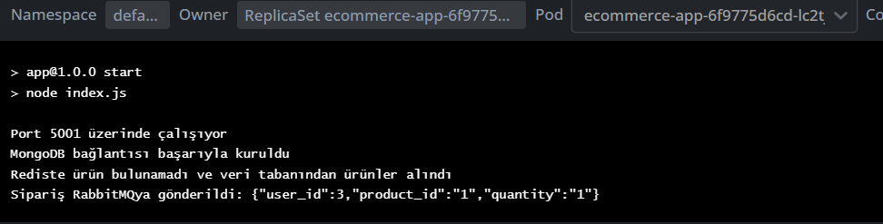

# Kubernetes E-Ticaret Projesi Dokümantasyonu

## Proje Yapısı
Proje, Kubernetes kullanılarak dağıtılmış, iki ana Node.js uygulamasından oluşan bir e-ticaret platformudur. 
app ve order-app olmak üzere iki adet Node.js uygulaması, kullanıcıların ürün listeleme, sipariş verme ve ürün değerlendirmesi gibi işlemleri yapabilmesini sağlar.

## Veri Tabanı Şemaları
### MySQL 
Tablolar kullanıcı bilgileri, ürün detayları ve sipariş bilgilerini saklamak için kullanılır.

Kullanıcılar: 'id', 'username', 'password_hash', 'email', 'createdAt'
Ürünler: 'id', 'name', 'description', 'price', 'stock', 'createdAt'
Siparişler: 'id', 'user_id', 'product_id', 'quantity', 'order_status', 'createdAt'

### MongoDB
Ürün Değerlendirmeleri: 'productId', 'userId', 'rating', 'title', 'review', 'createdAt'

## Uygulama Akışı
### Kullanıcı İşlemleri
Kullanıcılar uygulamada signup, login ve signout işlemlerini gerçekleştirebilir.

'signup': Yeni bir kullanıcı oluşturulur.
'login': Kullanıcı sisteme giriş yapar ve bir JWT token alır.
'signout': Kullanıcının mevcut sessionı sonlandırılır.

### Ürün İşlemleri
Kullanıcılar uygulamada ürün listesini görüntüleyebilir ve ürün değerlendirmesi yapabilir.

Ürün listeleme: Tüm ürünler listelenir ve Redis cache kullanılarak cache alınır.
Ürün değerlendirme: Kullanıcılar ürünlere değerlendirme yapabilir ve MongoDB'de saklanır.

### Sipariş İşlemleri
Kullanıcılar uygulamada sipariş verebilir.

Sipariş verme: Kullanıcının verdiği sipariş RabbitMQ aracılığıyla order-app node.js uygulamasına iletilir ve MySQL'de saklanır.

### Microservices
RabbitMQ: Sipariş işlemleri için asenkron kuyruk olarak kullanılır.
Redis: Session yönetimi ve ürün listeleme işlemleri için önbellek olarak kullanılır.
MongoDB ve MySQL: Veri saklamak için kullanılır.

## Kullanılan Teknolojiler
Backend: Node.js, Express.js
Veritabanları: MySQL, MongoDB
Cache: Redis
Mesaj Kuyruğu: RabbitMQ
Devops: Docker, Kubernetes
Güvenlik: JWT için jsonwebtoken, şifreleme için bcrypt

## Güvenlik
Tüm kullanıcı sessionları ve işlemlerinde JWT token ile güvenlik sağlanmıştır. Şifreler bcrypt kullanılarak şifrelenerek saklanmaktadır.

## Postman ile İstek Görselleri

